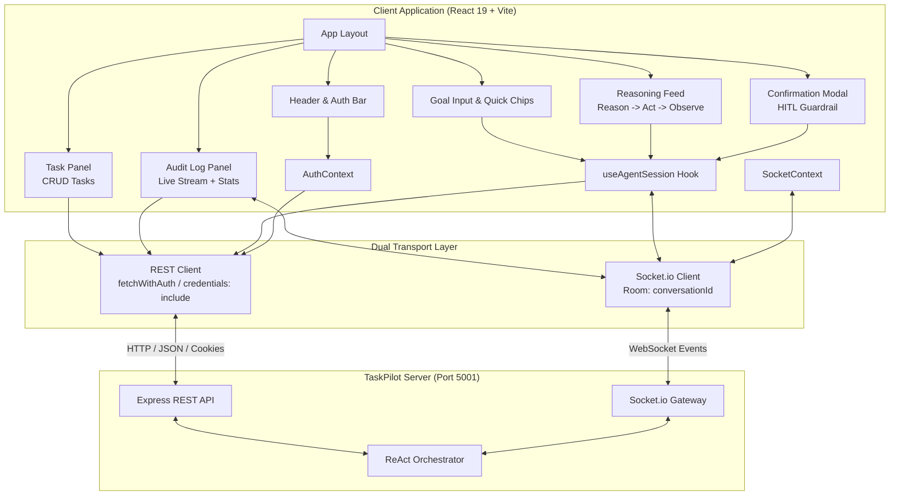

# TaskPilot Client — Architecture Specification

**A modern, real-time React dashboard visualizing hand-built agentic AI workflows, streaming ReAct loops, and Human-in-the-Loop guardrails.**

---

## 1. High-Level Client Architecture

---

## 2. Component Hierarchy & Responsibilities

| Component | File Path | Primary Responsibility |
|---|---|---|
| **App** | `src/App.jsx` | Root dashboard layout, 2-column responsive grid, modal management, unauthenticated callout banner. |
| **Header** | `src/components/Header.jsx` | App branding, active LLM model indicator, Socket connection pulse, Google Calendar link badge, Dev Login shortcut, and user session menu. |
| **GoalInput** | `src/components/GoalInput.jsx` | Controlled multi-line goal input, keyboard submission (`Enter`), execution disabled states, and quick-prompt suggestion chips. |
| **ReasoningFeed** | `src/components/ReasoningFeed.jsx` | Sequential ReAct step visualizer rendering 🧠 **REASON** (thoughts), ⚡ **ACT** (tools + formatted args), and 👁️ **OBSERVE** (outputs), plus final completion cards. |
| **ConfirmationModal** | `src/components/ConfirmationModal.jsx` | Human-in-the-Loop guardrail modal intercepting write actions, displaying formatted parameter previews with **Approve** and **Reject** handlers. |
| **TaskPanel** | `src/components/TaskPanel.jsx` | Database to-do manager with status filtering (`All`, `Pending`, `Completed`), inline task creation, completion toggles, and deletion. |
| **AuditLogPanel** | `src/components/AuditLogPanel.jsx` | Action audit trail with aggregated metrics (total calls, confirmed count, success rate), expandable JSON inspection, and live WebSocket row insertion. |
| **SystemInfoModal** | `src/components/SystemInfoModal.jsx` | Engineering overview modal detailing the hand-built ReAct loop, tool schemas, and security guardrails. |

---

## 3. State Management & Data Flow Architecture

The client adopts a modular, lightweight state architecture combining **React Context** for global singleton concerns and **Custom Hooks** for session-specific state:

### 3.1 Global Contexts
1. **`AuthContext` (`src/context/AuthContext.jsx`):**
   - Holds `user`, `loading`, `health`, and `error` states.
   - Automatically polls `GET /api/auth/me` on mount.
   - Provides `devLogin()` and `logout()` methods.
   - Computes `isAuthenticated` and `isConnectedToCalendar`.

2. **`SocketContext` (`src/context/SocketContext.jsx`):**
   - Initializes a singleton `io()` connection targeting `http://localhost:5001`.
   - Manages connection lifecycle (`connect`, `disconnect`, `connect_error`).
   - Exposes `socket` instance and `isConnected` boolean.

### 3.2 Session Orchestration Hook (`useAgentSession`)
- **Conversation Room Management:** Generates unique `conversationId` (`conv_<timestamp>_<random>`) and emits `join_conversation` / `leave_conversation` to ensure messages are isolated to the active session.
- **Event Subscriptions:**
  - `agent:step` → Appends new step (`{ step, thought, tool, args, result, isWriteAction }`) to the live feed.
  - `agent:confirm_request` → Halts active spinner and mounts `ConfirmationModal` with `pendingAction`.
  - `agent:complete` → Sets `finalAnswer`, clears pending states, and terminates execution loader.
  - `agent:error` → Captures and displays error alert.
- **Actions:**
  - `submitGoal(goal)` → Dispatches `POST /api/agent/task`.
  - `submitConfirmation(approved)` → Dispatches `POST /api/agent/confirm`.
  - `resetSession()` → Clears state and initializes a clean conversation ID.

---

## 4. WebSocket Event Contract

| Event Name | Direction | Payload Schema | Description |
|---|---|---|---|
| `join_conversation` | Client → Server | `conversationId: string` | Subscribes client socket to session room |
| `leave_conversation` | Client → Server | `conversationId: string` | Unsubscribes client socket from session room |
| `agent:step` | Server → Client | `{ step, thought, tool, args, result, isWriteAction, timestamp }` | Emitted on every Reason, Act, and Observe transition |
| `agent:confirm_request` | Server → Client | `{ confirmationId, tool, args, description, conversationId }` | Emitted when a write action is paused for human approval |
| `agent:complete` | Server → Client | `{ conversationId, finalAnswer, stepsCount }` | Emitted when the ReAct loop successfully finishes |
| `agent:error` | Server → Client | `{ conversationId, message, error }` | Emitted on unrecoverable orchestrator failure |
| `audit:new_log` | Server → Client | `{ _id, tool, status, confirmedByUser, executionDurationMs, createdAt }` | Global broadcast on every executed tool invocation |

---

## 5. Styling & Visual Design System

The client follows modern design standards to deliver a premium, portfolio-grade user experience:

- **Color Palette:**
  - Deep Dark Base: `#060911` (body), `#0b101d` (cards), `#111827` (nested surfaces).
  - Brand Emerald: `#10b981` (primary accents, active indicators, successful tools).
  - Amber Warning: `#f59e0b` (HITL confirmation badges, write tool indicators).
  - Indigo AI: `#6366f1` (LLM reasoning thoughts, prompt highlights).
  - Rose Danger: `#f43f5e` (rejection buttons, execution errors).
- **Glassmorphism:** `backdrop-blur-md`, semi-transparent backgrounds (`rgba(15, 23, 42, 0.75)`), and subtle border styling (`border-slate-800/80`).
- **Typography:**
  - UI Text: `Inter` via Google Fonts (clean, modern sans-serif).
  - Data / Tool Arguments: `JetBrains Mono` (monospace syntax formatting).
- **Responsive Layout:**
  - Mobile (< 768px): Single column stacked layout with touch-friendly touch targets.
  - Desktop (>= 1024px): 12-column grid with 7 columns for the ReAct stream and 5 columns for the tabbed workspace.

---

## 6. Security & Guardrails

1. **HttpOnly Cookie Persistence:** All REST requests set `credentials: 'include'`, preventing JavaScript from accessing JWT secrets directly and preventing XSS token theft.
2. **Schema-Enforced Previews:** Confirmation dialogs safely parse and render tool arguments rather than rendering raw unescaped HTML strings.
3. **Graceful Degradation:** When disconnected from WebSockets or when the backend server is temporarily down, status indicators clearly signal disconnected state without freezing the UI.
